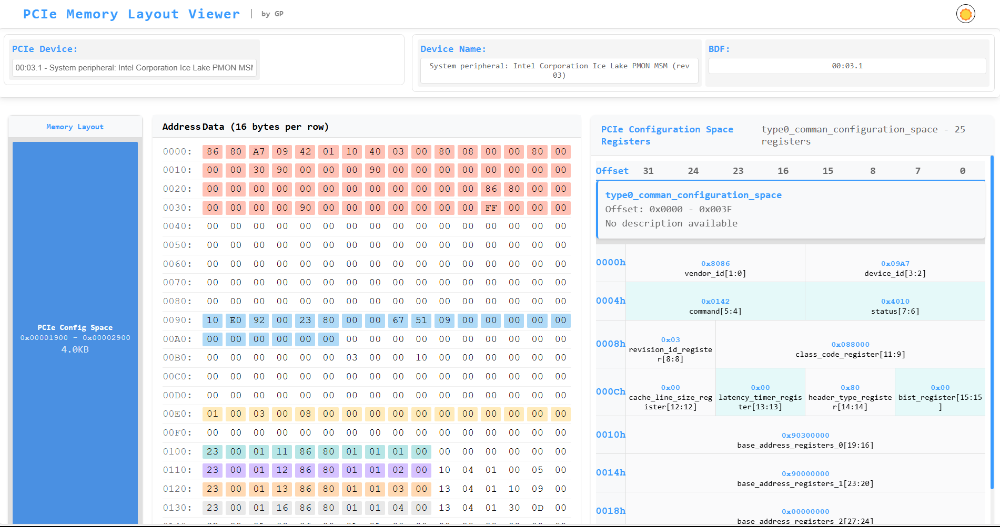
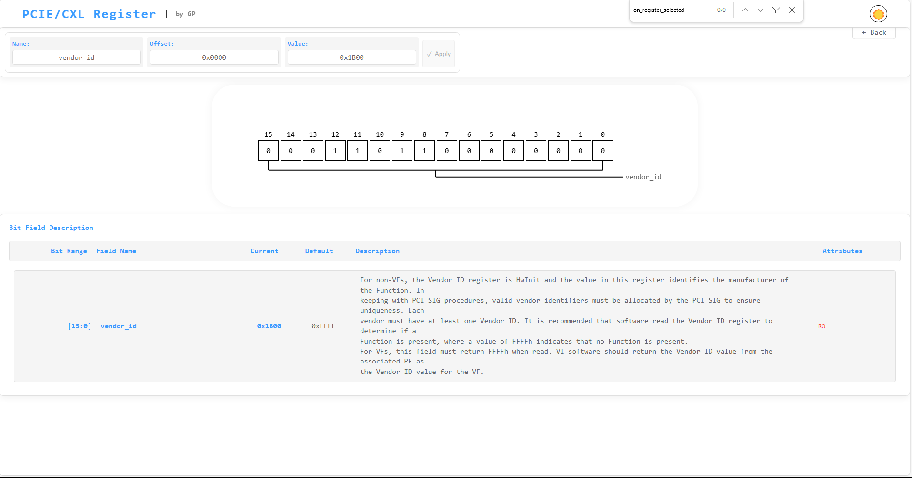

# PCIe Configuration Space Analysis Tool

## Project Overview
This tool provides a web-based interface for analyzing and manipulating PCIe device configuration spaces. It allows users to view, analyze, and modify PCIe device registers through an intuitive web interface, also you can also use programming in python.

**Only some registers are supported. If you need to add, just add the required registers information into the json file.**

## 1. Features
- Web-based interface for PCIe device analysis
- Real-time device register viewing and modification
- Support for multiple PCIe devices
- Detailed register and field-level analysis
- Memory region visualization
- Register value parsing and interpretation
- Device BDF (Bus:Device.Function) management
- Interactive register field manipulation

## 2. Dependencies
- Python 3.6+
- FastAPI
- Uvicorn
- thefuzz

## 3. Installation and Run
1. Clone the repository:
```bash
git clone git@github.com:paperg/pcie_config_space_analysis.git
cd pcie_config_space_analysis
```

2. Install dependencies:
```bash
pip install fastapi thefuzz uvicorn
```

3. install mmio driver tf you need to parse the bar space register, CXL uses.
```bash
cd pcie_config_space_analysis/mem_driver 
make
sudo insmod mmio_dynamic.ko
```

4. Run:
- use web server
```bash
python app.py -s
```

- Access the web interface:
Open your browser and navigate to `http://localhost:8000`

- **Or** Start with Terminal
```bash
python app.py -b bdf -r register_name -f field_name
```
```bash
python app.py -b 15:00.0 -f bar

    cmd: sudo lspci -xxxx -s 15:00.0 return data len: 4096
    BAR0 bar_base: 0x1e4ffe000000
    get_bar_space: 0x1e4ffe001000, 0x1000
    cmd: ['mem_driver/mmio_tool', 'r', '0x1e4ffe001000', '0x1000']
    cap_id: 2, cap_version: 2, cap_pointer: 32
    cap_id: 0, cap_version: 0, cap_pointer: 0
    cap_id: 4, cap_version: 2, cap_pointer: 272
    cap_id: 5, cap_version: 1, cap_pointer: 512
    Use bar, score: 72, May be you mean base_class_code
    # below is your need, above is debug info
    Field(name='base_class_code', bit_offset=16, bit_width=8, default=0, 
    value_parse={'note': 'Refer to PCI-Code-and-ID specification for encoding details.'}, 
    description='A code that broadly classifies the type of operation the Function performs. 
    Encodings for base class, are provided in the [PCI-Code-and-ID]. 
    All unspecified encodings are Reserved.', attributes='RO')
```

## 4. Project Structure
```
pcie_config_space_analysis/
├── app.py                 # Main application file
├── pciecfg/               # PCIe configuration parsing module, reg pcie 6.2r and cxl 3.2r
├── mem_driver/            # Memory access driver
├── templates/             # HTML templates
├── static/                # Static files (CSS, JS, etc.)
└── test_api.py            # API test suite
```

## 5. Key Components
- `app.py`: Main FastAPI application with all web endpoints
- `pciecfg/`: Core module for PCIe register parsing and analysis
- `templates/`: Web interface templates
- `static/`: Static assets for the web interface
- `mem_driver/`: Low-level memory access implementation

## 6. Usage Examples

### 1. python interface

Provide bdf, return a PCIeRegisterParser class instance, through which you can get registers or Field objects or lists, character fuzzy matching.

```python
    current_data_generator = PCIeDataFromOSGenerator('00:00.0')
    current_config_space_parser = PCIeRegisterParser(current_data_generator)
    print(current_config_space_parser['vendorid'])
```
### 2. Web
#### 2.1 Viewing Device List
1. Access the web interface
2. The device list will be automatically populated
3. Select a device by its BDF (Bus:Device.Function)




#### 2.2 Analyzing Registers
1. Select a device from the device list
2. View register blocks and their contents
3. Click on individual registers for detailed field-level analysis



#### 2.3 Modifying Registers
1. Navigate to the desired register
2. Modify field values as needed
3. Apply changes through the interface

## 7. API Endpoints
- `GET /`: Main web interface
- `GET /api/device`: List available PCIe devices
- `GET /api/memory/region`: Get memory regions for a device
- `GET /api/register`: Read register values
- `POST /api/register`: Write register values

## 8. License
MIT License

Copyright (c) [2025] [Gavyn]

Permission is hereby granted, free of charge, to any person obtaining a copy
of this software and associated documentation files (the "Software"), to deal
in the Software without restriction, including without limitation the rights
to use, copy, modify, merge, publish, distribute, sublicense, and/or sell
copies of the Software, and to permit persons to whom the Software is
furnished to do so, subject to the following conditions:

The above copyright notice and this permission notice shall be included in all
copies or substantial portions of the Software.

THE SOFTWARE IS PROVIDED "AS IS", WITHOUT WARRANTY OF ANY KIND, EXPRESS OR
IMPLIED, INCLUDING BUT NOT LIMITED TO THE WARRANTIES OF MERCHANTABILITY,
FITNESS FOR A PARTICULAR PURPOSE AND NONINFRINGEMENT. IN NO EVENT SHALL THE
AUTHORS OR COPYRIGHT HOLDERS BE LIABLE FOR ANY CLAIM, DAMAGES OR OTHER
LIABILITY, WHETHER IN AN ACTION OF CONTRACT, TORT OR OTHERWISE, ARISING FROM,
OUT OF OR IN CONNECTION WITH THE SOFTWARE OR THE USE OR OTHER DEALINGS IN THE
SOFTWARE.


## 9. Support
For issues and feature requests, please use the project's issue tracker. 

## 10. Software design manuscript

1. Get PCIE config space data command

```bash
sudo lspci -xxxx -s b:d.f | xxd -r -p > config_space.bin
```

2. get CXL rgister data
use linux mmio driver.


3. what is field?
```python
class Field:
    # Bit offset of the field in the register
    bit_offset: int

    # Width of the field in bits
    bit_width: int

    # Field description, may contain multiline text
    description: str

    # Access attributes (e.g., RW, RO, VF, ROZ), may span multiple lines
    attributes: str

    def mask(self) -> int:
        """Generate bitmask for the field (not shifted)"""
        return (1 << self.bit_width) - 1

    def extract(self, value: int) -> int:
        """Extract field value from a complete register value"""
        return (value >> self.bit_offset) & self.mask()

    def bit_range(self) -> str:
        """Return bit range string like [7:0]"""
        end = self.bit_offset + self.bit_width - 1
        return f"[{end}:{self.bit_offset}]"

	class Register:
    name: str                # Register name
    offset: int              # Offset relative to the containing structure
    size: int                # Register size in bits
    type: str                # 'pci', 'pcie', 'extended', 'CXL'
    raw: int                 # Raw binary value
    fields: List[Field] = [] # Field list

    def __getitem__(self, key):
        # Access field by name
        ...

    def debug(self) -> str:
        # Return human-readable representation of the register and fields
        ...

    def get_register_by_name(self, name: str):
        # Exact match
        ...

    def get_register_by_fuzzy_name(self, name: str):
        # Fuzzy name match using thefuzz or similar
        ...

    def get_field_value(self, register_name: str, field_name: str):
        # Return specific field value
        ...

    def get_field_value_fuzzy(self, register_name: str, field_name: str):
        # Fuzzy field name search within register
        ...
```

4. What is structure?
It is a register block.
```python
class CapabilityStructure:
    name: str
    cap_id: Optional[int]    # For PCI-compatible, this is None
    offset: int              # Offset in the config space
    raw: bytes               # Raw binary block
    registers: List[Register]

    def get_register_by_name(self, name: str):
        ...

    def get_register_by_offset(self, offset: int):
        ...

    def __getitem__(self, key):
        # Field or register access
        ...

    def __repr__(self):
        ...


class PCIeRegisterFactory:
    def __init__(self, config_space: bytes):
        self.config_space = config_space

    def get_register(self, key):
        # Unified access: key can be name (fuzzy), offset, or type+name
        ...


class PCIeRegisterFactory:
    def __init__(self, config_space: bytes):
        self.config_space = config_space

    def get_register(self, key):
	
	
	def parse_pci_compatible(config_space: bytes):
	def parse_capabilities(config_space: bytes):
	def parse_extended_capabilities(config_space: bytes):

```
6. How to classify registers
```
0 - 3f:
1. PCI-compatible Configuration

34 - ff:
2. PCIe capability structure
	cap_id 7:0
	next 15:8

ff - fff:
2. PCIE extebded capability structure
	cap_id 15:0
	next 31:20
	
	1. commond
	2. dvsec	   cap_id = 0x23
		
		dv header vendor id = 0x1e98
	
	
3. DVSEC 0x23 , dvsec id = 0x8 Register Locator DVSEC
Register Locator DVSEC locate CXL register

```	

7. pci register json format:

```json
	pci: {
		structure:
		{
			type0_comman_configuration_space: {  # reg_name
				'vendor_id',
				'device_id',
				'command',
				'status',
				...
			}
			
		}
			
		register:
		{
			vendor_id: {
				
			}
			
			command: {
				cap_id: 0,
				offset:0,
				size: 64,
				fileds:{
					{
						bit:0,
						bit_width:1,
						name: 'io_space_enable',
						default: 0,
						value_parse: {
							0: 
							1:
						}
						description: 'sdad\n',
						attributes: 'RW \nVF ROZ',
					},
					{
						bit:1,
						...
					}
				}
			}
			
			....
		}
	}
```

8. pcie capability json format:
```json
pcie: {
    structure:
    {
        MSIExtensionCapability: { # name
            depand_on : {
                'MessageUpperAddressRegister': address_64bit_capable,
                'MaskBitsRegister': per_vector_masking_capable,
            },
            'MessageControlRegister',
            'MessageUpperAddressRegister',
            'MessageDataRegister',
            ...
        }
        
    }
        
    register:
    {
        MessageControlRegister: {
            cap_id: 0x5,
            offset:0,
            size: 64,
            fileds:{
                {
                    bit:0,
                    bit_width:1,
                    description: 'sdad\n', # support \n
                    attributes: 'RW \nVF ROZ',
                },
                {
                    bit:1,
                    ...
                }
            }
        }
        
        ....
    }
}
```
9. pcie extebded capability


10. dvsec 

11. cxl
